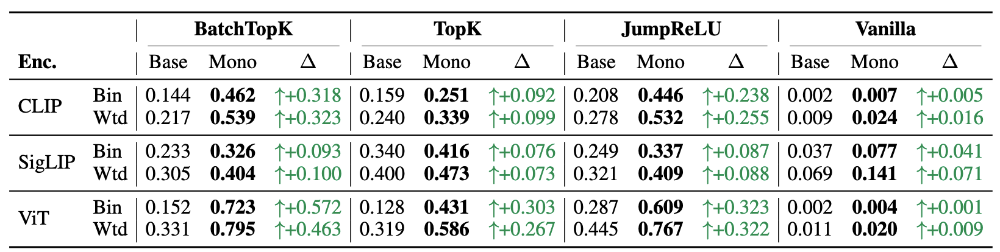
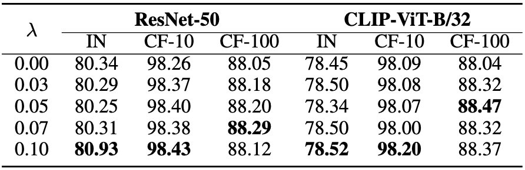
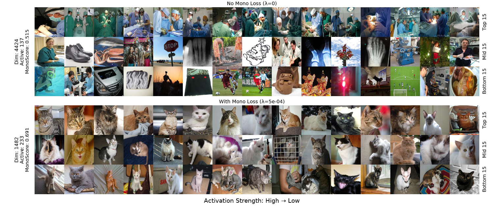
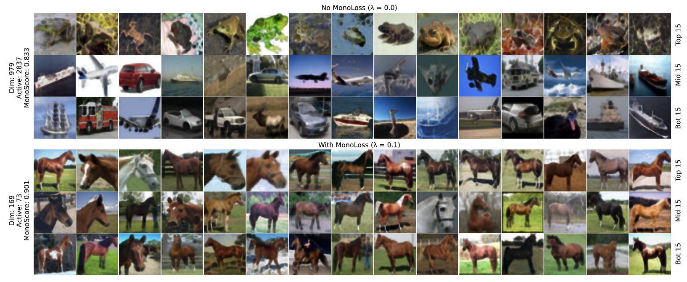

# MonoLoss: A Training Objective for Interpretable Monosemantic Representations

Official implementation of **MonoLoss**, a plug-and-play training objective that directly rewards semantically consistent activations for learning interpretable monosemantic representations in Sparse Autoencoders (SAEs).

<p align="center">
  
</p>

<div align ="center">
  
  [](https://arxiv.org/abs/2602.12403)
  
</div>

## Abstract

Sparse autoencoders (SAEs) decompose polysemantic neural representations, where neurons respond to multiple unrelated concepts, into monosemantic features that capture single, interpretable concepts. However, standard training objectives only weakly encourage this decomposition, and existing monosemanticity metrics require pairwise comparisons across all dataset samples, making them inefficient during training and evaluation.

We study a recent MonoScore metric and derive a **single-pass algorithm** that computes exactly the same quantity, but with a cost that grows **linearly, rather than quadratically**, with the number of dataset images. On OpenImagesV7, we achieve up to a **1200× speedup** in evaluation and **159×** during training, while adding only ~4% per-epoch overhead.

This allows us to treat MonoScore as a training signal: we introduce **MonoLoss**, a plug-in objective that directly rewards semantically consistent activations. Across SAEs trained on CLIP, SigLIP2, and pretrained ViT features, using BatchTopK, TopK, and JumpReLU SAEs, MonoLoss increases MonoScore for most latents and consistently improves class purity across all encoder and SAE combinations.

Used as an auxiliary regularizer during ResNet-50 and CLIP-ViT-B/32 finetuning, MonoLoss yields up to **0.6\% accuracy gains on ImageNet-1K** and **monosemantic activating patterns** on standard benchmark datasets.

## Key Results

### Consistent gain on Monosemanticity
<p align="center">
  
  <br>
  <em>MonoLoss consistently raises monosemanticity across nearly all configuration.</em>
</p>

### Higher class purity
<p align="center">
  
  <br>
  <em>MonoLoss increases purity in all 12 settings for both binary purity and weighted purity.</em>
</p>

### Linear-Time Calculation for MonoScore

**~1200× speedup** at 50k samples, growing with dataset size. See [`sae/loss.py`](sae/loss.py):
- `compute_monosemanticity_fast()` — linear-time O(N) evaluation
- `compute_monosemanticity_loss_batch()` — batch-level training loss
- `compute_monosemanticity_ref()` — quadratic O(N²) reference

<p align="center">
  
  <br>
  <em>Our linear implementation makes large-scale evaluation feasible.</em>
</p>


### Higher finetuning performance
<p align="center">
  
  <br>
  <em>Adding MonoLoss yields consistent performance gains on both ResNet-50 and CLIP-ViT-B/32 and all datasets (ImageNet-1k, CIFAR-10, and CIFAR-100).</em>
</p>


### Monosemantic activation patterns
<p align="center">
  
  <em>MonoLoss provide better class purity qualitatively for SAE activations.</em>
</p>

<p align="center">
  
  <br>
  <em>MonoLoss provide better class purity qualitatively for finetuned vision model activations.</em>
</p>

## Installation

```bash
git clone https://github.com/YOUR_USERNAME/MonoLoss.git
cd MonoLoss
pip install -r requirements.txt
```

## Repository Structure

```
MonoLoss/
├── sae/                        # SAE training with MonoLoss (see sae/README.md)
├── finetuning/                 # Vision model finetuning (see finetuning/README.md)
```

## Usage

### SAE training
See [`sae/README.md`](sae/README.md) for detailed instructions on:
- Feature extraction from CLIP, SigLIP2, and ViT encoders
- Training SAEs (BatchTopK, TopK, JumpReLU, Vanilla) with MonoLoss
- Reproducing paper experiments

**Example:**
```bash
cd sae

# Train baseline SAE
python main.py --dataset_config config/imagenet_clip.json --model batch_topk --mono_coef 0.0

# Train with MonoLoss
python main.py --dataset_config config/imagenet_clip.json --model batch_topk --mono_coef 0.0003
```

### Vision finetuning
See [`finetuning/README.md`](finetuning/README.md) for detailed instructions on:
- Downloading pre-extracted CLIP-ViT-L/14 features for calculating similarities.
- Finetuning recipes for ResNet50 and CLIP-ViT-B/32 on ImageNet-1K, CIFAR-10, and CIFAR-100.

**Example:**
```bash
BASE_PORT=29650
i=0

# Finetuning ResNet on ImageNet-1K with multiple lambda values (0.0 is the baseline setting)
for lam in 0.0 0.03 0.05 0.07 0.1; do
  port=$((BASE_PORT + i))
  i=$((i + 1))
  sh scripts/imagenet/resnet.sh "${port}" "${lam}"
done
```

## Citation
```
@misc{nasirisarvi2026monoloss,
      title={MonoLoss: A Training Objective for Interpretable Monosemantic Representations}, 
      author={Ali Nasiri-Sarvi and Anh Tien Nguyen and Hassan Rivaz and Dimitris Samaras and Mahdi S. Hosseini},
      year={2026},
      eprint={2602.12403},
      archivePrefix={arXiv},
      primaryClass={cs.CV},
      url={https://arxiv.org/abs/2602.12403}, 
}
```

## License

This project, MonoLoss, is licensed under the **CC BY-NC 4.0** license. This means you are free to share and adapt the material for non-commercial purposes, provided you give appropriate credit to the original author(s) and indicate if changes were made. For any commercial use or licensing inquiries, please contact the repository owner directly.

## Acknowledgments
Our framework is based on [OpenAI's SAE repo](https://github.com/openai/sparse_autoencoder), [BatchTopK SAE](https://github.com/bartbussmann/BatchTopK/), [SPARC](https://github.com/AtlasAnalyticsLab/SPARC/), [torchvision](https://github.com/pytorch/vision/tree/main/references/classification), and [MonoScore](https://github.com/ExplainableML/sae-for-vlm). Thanks for their outstanding code.
