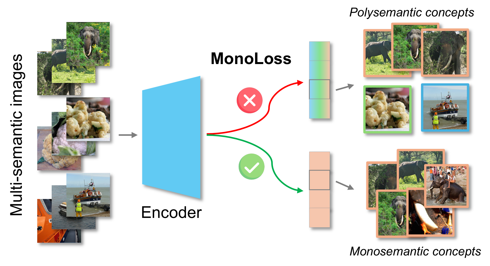
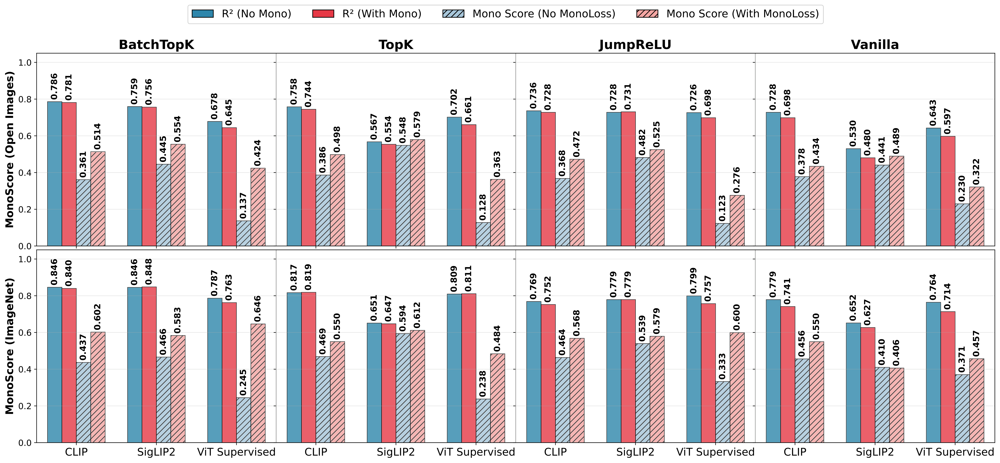
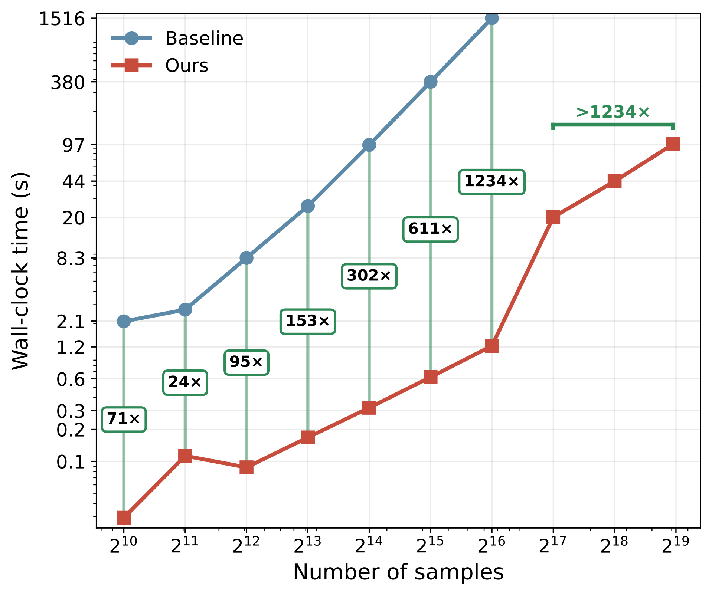

# MonoLoss: A Training Objective for Interpretable Monosemantic Representations

Official implementation of **MonoLoss**, a plug-and-play training objective that directly rewards semantically consistent activations for learning interpretable monosemantic representations in Sparse Autoencoders (SAEs).

<p align="center">
  
</p>

## Abstract

Sparse autoencoders (SAEs) decompose polysemantic neural representations, where neurons respond to multiple unrelated concepts, into monosemantic features that capture single, interpretable concepts. However, standard training objectives only weakly encourage this decomposition, and existing monosemanticity metrics require pairwise comparisons across all dataset samples, making them inefficient during training and evaluation.

We study a recent MonoScore metric and derive a **single-pass algorithm** that computes exactly the same quantity, but with a cost that grows **linearly, rather than quadratically**, with the number of dataset images. On OpenImagesV7, we achieve up to a **1200× speedup** in evaluation and **159×** during training, while adding only ~4% per-epoch overhead.

This allows us to treat MonoScore as a training signal: we introduce **MonoLoss**, a plug-in objective that directly rewards semantically consistent activations. Across SAEs trained on CLIP, SigLIP2, and pretrained ViT features, using BatchTopK, TopK, and JumpReLU SAEs, MonoLoss increases MonoScore for most latents and consistently improves class purity across all encoder and SAE combinations.

## Key Results



- **Improved monosemanticity**: Consistent MonoScore gains across all encoder-SAE combinations
- **Higher class purity**: Largest gain raises baseline purity from 0.152 to 0.723

### Linear-Time MonoScore

**~1200× speedup** at 50k samples, growing with dataset size. See [`sae/loss.py`](sae/loss.py):
- `compute_monosemanticity_fast()` — linear-time O(N) evaluation
- `compute_monosemanticity_loss_batch()` — batch-level training loss
- `compute_monosemanticity_ref()` — quadratic O(N²) reference


<p align="center">
  
</p>

## Installation

```bash
git clone https://github.com/YOUR_USERNAME/MonoLoss.git
cd MonoLoss
pip install -r requirements.txt
```

## Repository Structure

```
MonoLoss/
├── sae/                        # SAE training with MonoLoss (see sae/README.md)
├── finetuning/                 # Vision model finetuning (coming soon)
```

## Usage

See [`sae/README.md`](sae/README.md) for detailed instructions on:
- Feature extraction from CLIP, SigLIP2, and ViT encoders
- Training SAEs (BatchTopK, TopK, JumpReLU, Vanilla) with MonoLoss
- Reproducing paper experiments

**Quick example:**
```bash
cd sae

# Train baseline SAE
python main.py --dataset_config config/imagenet_clip.json --model batch_topk --mono_coef 0.0

# Train with MonoLoss
python main.py --dataset_config config/imagenet_clip.json --model batch_topk --mono_coef 0.0003
```

## Citation


## License

[Add license information]

## Acknowledgments

[Add acknowledgments]
